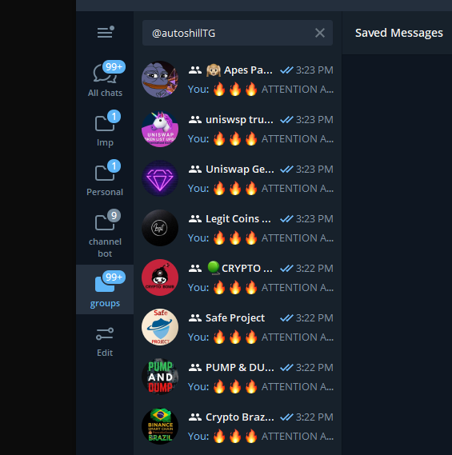

# 🔥🔥🔥 AutoShill 🔥🔥🔥

Automatic Shilling Program for Telegram

# 🔗 Links

Join this channel to get official updates and announcements.  
📣 Channel: https://t.me/AutoShillTG  
Join this group to ask / discuss / request for this tool.  
👥 Group: https://t.me/AutoShillChat   
All the informations are in this github  
📝 Github: https://github.com/AllCoinLab/AutoShill  
Any questions, promotions, etc  
📞 Contact: https://t.me/AllCoinLab  

# 🖥 DEMO Videos
Working DEMO (windows Upgraded version)    
https://youtu.be/4KG2Fk02qiM  

How to use DEMO (web version)  
https://youtu.be/w5V9rBg2T1g  
  

Working DEMO: (windows Old version)  
https://youtu.be/XXkYkA9XJ1g  

# Versions
🔴🟡🟢🔵
## Windows version: Launched 🟢  
## Web version: Launched 🟢  

# 💸 Introduction

### 🔥🔥🔥 ATTENTION ALL SHILLERS!! 🔥🔥🔥 
  
With this program,  
you can **SHILL** with **MAXIMUM EFFICIENCY** to more groups with **FREE** hands.  
Do other things! rest, play, or find more opportunities.  

For the launch event,
it will be **FREE** to use for all of you.  
Follow the instructions below.

# 🔥🔥 IMPORTANT 🔥🔥
## DON'T DO ANYTHING WHICH IS NOT MENTIONED IN INSTRUCTION
You may get **PERMANENT BAN** by the Telegram system if you do something which I didn't say.  

## PLEASE READ INSTRUCTIONS FIRST
As **REALLY MANY** people asking for the issue,  
I cannot answer all of them.  
Please read instructions and follow the steps first.  
If you have trouble even if you do that,  
DM https://t.me/AllCoinLab is always welcome :)

# ALL INFOS ARE IN THE WIKI
https://github.com/AllCoinLab/AutoShill/wiki

# DISCLAIMER
This is made for the shillers to shill more effectively and efficiently.  
If you use too much in too much TG groups with too much accounts,
it may lead unexpected results by the TG system. (ex. mute / ban)  
This tool is tested with many situations.  
(Up to 130+ groups for 24+ hours)  
But it may differ because of the various slow mode cooldown for each group  
regard many environment / situation of your account / computer

This tool has some safety methods to avoid it,  
but this is not responsible for those unexpected results.  
It is up to **YOU** to adjust using time and target group counts to avoid it.

# Other Project
Check my other projects too :)  
HoneyProof: Checks honeypot tokens  
https://github.com/AllCoinLab/honeyproof
